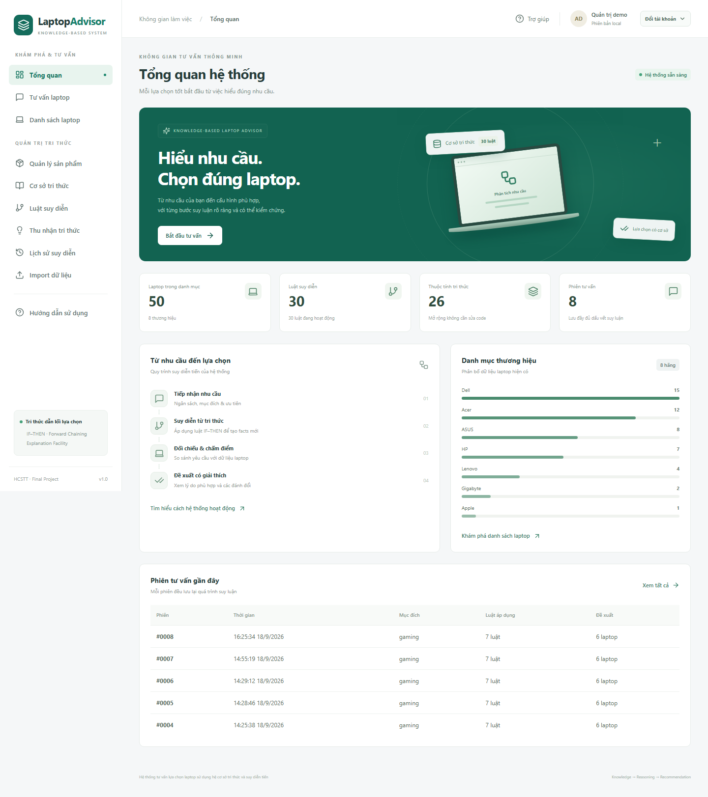
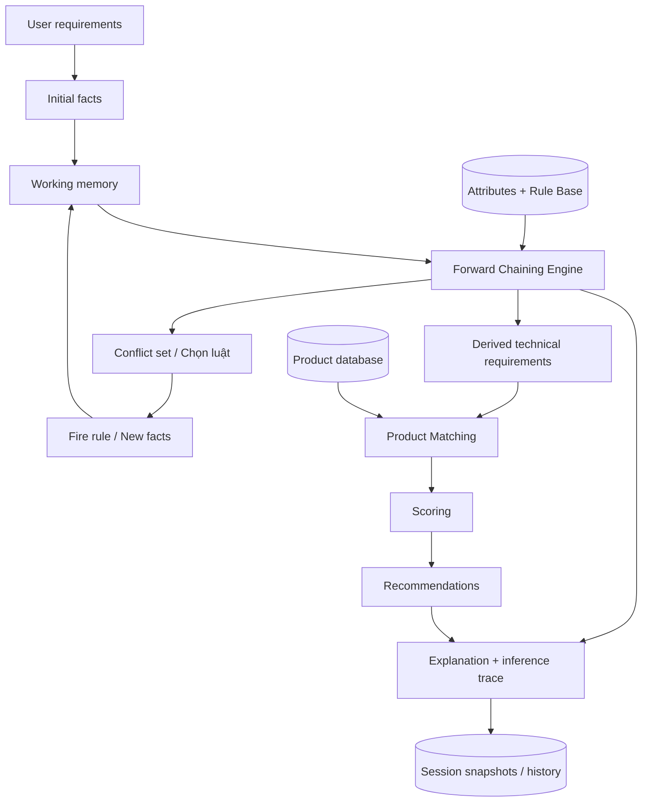
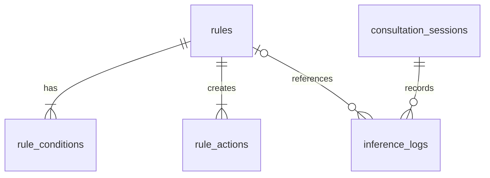

# Hệ thống tư vấn lựa chọn laptop sử dụng hệ cơ sở tri thức và suy diễn tiến

Ứng dụng local hoàn chỉnh gồm **React + TypeScript + Tailwind CSS**, **FastAPI + SQLAlchemy**, và **SQLite**. Tri thức được lưu trong database và quản lý qua giao diện. Forward Chaining Engine tạo yêu cầu kỹ thuật trước khi Product Matcher đọc thông số laptop và chấm điểm.



## 1. Chạy nhanh trên Windows

Yêu cầu: **Python 3.11+**, **Node.js 22+**. Đã kiểm tra trên Python 3.13 và Node.js 24. Không cần SQLite CLI, PostgreSQL, MySQL hay MongoDB.

Mở PowerShell tại thư mục dự án:

```powershell
powershell -ExecutionPolicy Bypass -File .\start-local.ps1 -Setup
```

Lệnh này tạo virtual environment nếu thiếu, cài packages, khởi tạo database, seed tri thức, nhập `Laptop_data.xlsx` và chạy hai dịch vụ ẩn. Lần sau chạy:

```powershell
.\start-local.ps1
```

- Giao diện: http://127.0.0.1:5173
- Swagger API: http://127.0.0.1:8000/docs
- Health check: http://127.0.0.1:8000/api/health
- Log: `.runtime/backend.log`, `.runtime/backend-error.log`, `.runtime/frontend.log`.
- Dừng dịch vụ do script tạo: `powershell -ExecutionPolicy Bypass -File .\stop-local.ps1`.

`-Setup` nhập lại Excel theo chế độ cập nhật mã trùng. Không dùng tùy chọn này nếu muốn giữ các chỉnh sửa sản phẩm thủ công thay vì dữ liệu trong Excel. Script không dừng dịch vụ khác đang sử dụng cổng 8000 hoặc 5173.

### Xử lý lỗi bind cổng trên Windows

Nếu terminal in `WinError 10013` hoặc `WinError 10048` tại bước `bind on address ('127.0.0.1', 8000)`, thường là backend đã chạy rồi. Không mở thêm một Uvicorn process trên cùng cổng. Kiểm tra:

```powershell
Get-NetTCPConnection -LocalPort 8000 -State Listen
Invoke-RestMethod http://127.0.0.1:8000/api/health
```

Nếu health check trả `status = ok`, mở luôn http://127.0.0.1:5173 và không chạy lại lệnh Uvicorn. Muốn chạy thủ công thay cho script, dừng process do project tạo trước:

```powershell
powershell -ExecutionPolicy Bypass -File .\stop-local.ps1
cd backend
.venv\Scripts\python.exe -m uvicorn app.main:app --host 127.0.0.1 --port 8000 --reload
```

Nếu cổng bị một ứng dụng khác giữ, xem PID rồi chỉ dừng đúng PID đó sau khi xác nhận tên process:

```powershell
$connection = Get-NetTCPConnection -LocalPort 8000 -State Listen
Get-Process -Id $connection.OwningProcess
# Chỉ khi đúng là process cũ của project:
Stop-Process -Id $connection.OwningProcess
```

Máy kiểm tra hiện tại chỉ reserve TCP port 5357; port 8000 không nằm trong dải cổng bị Windows loại trừ. Vì vậy lỗi gặp khi chạy lại lệnh trong README là xung đột process đang nghe cổng, không phải thiếu quyền đọc database. Không dùng `netsh http delete urlacl` hoặc tắt firewall để xử lý lỗi này.

## 2. Cài đặt và chạy thủ công

Backend — terminal thứ nhất:

```powershell
cd backend
python -m venv .venv
.venv\Scripts\python.exe -m pip install -r requirements.txt
Copy-Item .env.example .env
.venv\Scripts\python.exe scripts/setup.py --excel "../Laptop_data.xlsx"
.venv\Scripts\python.exe -m uvicorn app.main:app --host 127.0.0.1 --port 8000 --reload
```

Frontend — terminal thứ hai, bắt đầu từ thư mục dự án:

```powershell
cd frontend
npm ci
npm run dev
```

Nếu `npm ci` trên Windows báo `EPERM`, `EBUSY`, `operation not permitted` hoặc không thể xóa file trong `node_modules`, hãy dừng Vite trước vì Vite đang giữ các file dependency:

```powershell
cd ..
powershell -ExecutionPolicy Bypass -File .\stop-local.ps1
cd frontend
npm ci
npm run build
```

Không chạy `npm ci` đồng thời với `npm run dev` hoặc một cửa sổ đang chạy `start-local.ps1`. `npm ci` sẽ tái tạo toàn bộ `node_modules` theo `package-lock.json`; lệnh này không sửa source code. Cảnh báo npm về `esbuild` `postinstall` là cảnh báo script, không phải lỗi dependency; trong môi trường local của project, cài đặt vẫn hoàn tất khi hiện `added ... packages` và `found 0 vulnerabilities`.

Linux/macOS: thay `.venv\Scripts\python.exe` bằng `.venv/bin/python`, `Copy-Item` bằng `cp`. Các lệnh Python/npm còn lại tương đương.

Build frontend:

```powershell
cd frontend
npm run build
```

Vite dev server proxy `/api` sang backend `127.0.0.1:8000`. Để phục vụ bản `dist` ngoài môi trường dev, cấu hình web server proxy `/api` về FastAPI; `vite preview` đơn thuần chưa phải cách triển khai đầy đủ backend.

## 3. Dữ liệu đầu vào và chuẩn hóa

File đã kiểm tra: `Laptop_data.xlsx`, sheet đầu tiên, **50 sản phẩm**, **12 cột**, **8 nhãn hàng**. Xem [báo cáo Excel](docs/EXCEL_INSPECTION.md).

| Cột Excel | Trường lưu / chuẩn hóa |
|---|---|
| STT | `raw_data` |
| Mã sản phẩm | `product_code` UNIQUE |
| Tên sản phẩm | `product_name` |
| Giá sản phẩm | `price` (VND), giữ gốc trong `raw_data` |
| Nhãn hàng | `brand` |
| CPU / GPU | `cpu`, `gpu`, phân loại đặc tính khi matching |
| RAM | `ram_gb` |
| Trọng lượng | `weight_raw`, `weight_kg` |
| Dung lượng bộ nhớ | `storage_raw`, `storage_gb` |
| Màu sắc | `color` |
| Màn hình | `display_raw`, `screen_size_inch`, `resolution`, `refresh_rate_hz` |

Quy ước: **1 TB = 1024 GB**. `Khoảng 1,53 kg` → `1.53`; `512 GB SSD` → `512`; `15.6 inch FHD 144Hz` → `15.6`, `FHD`, `144`. `14 OLED` không tự được gán 60 Hz. `Chưa xác minh` giữ nguyên bản gốc, trường chuẩn hóa là `null` nếu không đủ thông tin. Trọng lượng “Từ”, “Khoảng”, “Tối đa”, “tùy cấu hình” có cảnh báo tham khảo.

Importer dùng pandas/openpyxl, savepoint theo dòng và commit toàn bộ báo cáo. Dòng thiếu mã/tên hoặc có số âm bị từ chối, có số dòng và dữ liệu gốc trong `errors`. Các dòng hợp lệ khác vẫn được nhập. Trong cùng file, mã lặp được báo cáo; chế độ cập nhật lấy dòng hợp lệ cuối cùng, chế độ bỏ qua giữ dòng đầu tiên đã nhập. Không có danh sách laptop hard-code trong source.

Import lại qua giao diện **Import dữ liệu**, hoặc:

```powershell
cd backend
.venv\Scripts\python.exe scripts/import_laptops.py --excel "../Laptop_data.xlsx"
# Chỉ thêm mã mới:
.venv\Scripts\python.exe scripts/import_laptops.py --excel "../Laptop_data.xlsx" --skip-existing
```

File Excel gốc không bị chỉnh sửa. Dữ liệu phải có đủ tên cột ở dòng đầu, đọc sheet đầu tiên, upload tối đa 20 MB. Báo cáo import tải được dưới dạng JSON.

## 4. Mục tiêu và bản chất Knowledge-Based System

Hệ thống trả lời hai câu hỏi: **cấu hình nào phù hợp với nhu cầu**, và **vì sao đưa ra đề xuất đó**. Kết quả kỹ thuật xuất phát từ tri thức IF–THEN, không phải một truy vấn SQL mô phỏng suy luận.



**Fact** là cặp tên–giá trị, ví dụ `purpose = gaming`. **Initial Facts** là yêu cầu ban đầu. **Working Memory** là bộ facts của từng phiên. **Rule Base** gồm các luật dữ liệu, được tải từ SQLite. **Explanation Facility** trình bày điều kiện khớp, conflict set, quyết định chọn luật, facts trước/sau, nguồn của yêu cầu và điểm của từng laptop.

## 5. Forward Chaining, conflict resolution và kết luận trùng

`app/inference/engine.py` không import model Product, không gọi SQL, không biết tên laptop.

1. Sao chép initial facts vào working memory, tạo tập luật đã chạy.
2. Tìm tất cả luật enabled, chưa chạy, có IF khớp.
3. Chọn **priority lớn hơn → số điều kiện nhiều hơn → rule_code tăng dần**.
4. Áp dụng THEN bằng chiến lược gộp của từng thuộc tính.
5. Lưu snapshot before/after, conditions có kết quả true/false, generated facts, action outcomes và conflict set.
6. Xét lại toàn bộ luật, kể cả luật được facts mới kích hoạt.
7. Dừng khi không còn luật khả dụng hoặc chạm `max_iterations` (mặc định 200, API tối đa 1000).

Mỗi luật chạy tối đa một lần mỗi phiên, fact giống hệt không được thêm lặp. Luật không tạo facts mới vẫn được ghi log và **không chặn** các luật khác. Vòng A→B→A hữu hạn nhờ tập fired rules. Nếu chạm giới hạn, API trả `termination=max_iterations`, giao diện báo kết quả suy diễn chưa đầy đủ.

| `merge_strategy` | Ý nghĩa | Ví dụ |
|---|---|---|
| first | Giữ giá trị xuất hiện trước; đầu vào có ưu tiên | hãng, loại GPU, phân khúc |
| max | Giữ yêu cầu lớn hơn | min_ram, min_storage |
| min | Giữ giới hạn nhỏ hơn | max_weight, budget_max |
| or | true không bị false ghi đè | require_dedicated_gpu |

Đây là hệ sản xuất facts tăng cường có chính sách giữ/gộp, chưa phải hệ truth-maintenance có thu hồi kết luận. Điều kiện được đánh giá tại thời điểm luật chạy; log giữ thời điểm đó. Khi hai yêu cầu mâu thuẫn, action outcomes nêu rõ giá trị đề xuất và giá trị giữ lại; sản phẩm có thể không đạt một phần yêu cầu.

Toán tử: `=`, `!=`, `>`, `>=`, `<`, `<=`, `IN`, `NOT IN`, `CONTAINS`. Fact chưa tồn tại không khớp, kể cả `!=` và `NOT IN`. `CONTAINS` không phân biệt hoa thường. Có nhóm AND/OR hai cấp: điều kiện trong nhóm dùng `group_operator`, các nhóm nối bằng `logical_operator`. Ví dụ `purpose=gaming AND (gaming_level=medium OR gaming_level=high)` biểu diễn được; chưa có cây nhóm sâu tùy ý.

## 6. Seed tri thức và ví dụ suy diễn

Có **26 thuộc tính** và **30 luật mẫu**, đủ 16 nhóm General, Student, Office, Programming, Gaming, Graphics, Video Editing, AI / Data Science, Engineering, Mobility, Display, Storage, RAM, GPU, CPU, Budget. Cấu hình seed: `app/knowledge_base/seed.py`. Chỉ seed khi cả thuộc tính và luật còn trống; chạy lại không chèn trùng và không tự phục hồi luật đã xóa trong cơ sở tri thức đang có dữ liệu.

Đầu vào:

```json
{
  "facts": {
    "budget_max": 30000000,
    "purpose": "gaming",
    "gaming_level": "medium",
    "mobility_priority": "high"
  }
}
```

Chuỗi suy diễn điển hình:

- R002: gaming + medium → RAM ≥16, cần GPU rời, gợi ý RTX3050_or_higher.
- R026: fact mới `require_dedicated_gpu=true` → `preferred_gpu_type=dedicated`.
- R010: GPU rời + ngân sách ≤30 triệu → `min_gpu_level=2`.
- R005: di chuyển cao → trọng lượng ≤1.6 kg.
- R018: gaming + GPU rời → tần số quét ≥120 Hz.
- R022/R029/R025 bổ sung phân khúc, lưu trữ và nền tảng cơ bản.

Luật R026/R010 chứng minh **chaining**: chúng chỉ khớp sau khi facts mới được luật khác tạo. Trình xem suy luận thể hiện thứ tự thực tế, các lựa chọn trong conflict set và nguồn từng fact. [Ảnh Working Memory](docs/inference.png).

## 7. Product Matching và chấm điểm

Matcher chạy **sau** inference, đọc final facts và metadata ánh xạ thuộc tính: `product_field`, `match_operator`, `score_category`. Thuộc tính mới có thể ánh xạ trường có sẵn mà không sửa source. CPU/GPU được nhận diện theo chuỗi, dữ liệu không rõ được để unknown.

- Ngân sách và nhóm `other` (hãng, CPU cụ thể, màu…) là ràng buộc bắt buộc. Không có sản phẩm thì trả mảng rỗng, không tự nâng ngân sách.
- RAM/GPU/storage/display/weight là tiêu chí chấm điểm. Kết quả gần phù hợp có thể xuất hiện, luôn kèm tiêu chí chưa đạt hoặc chưa xác minh.
- Yêu cầu boolean false nghĩa là **không bắt buộc**, không cấm tính năng đó. `require_dedicated_gpu=true` được kiểm tra trực tiếp kể cả khi luật suy ra loại GPU bị tắt.
- Sáu trọng số: ngân sách **25**, RAM **20**, GPU **25**, lưu trữ **10**, màn hình **10**, trọng lượng **10**.
- Chỉ các nhóm thực sự có yêu cầu tham gia mẫu số. Điểm một nhóm chia đều các tiêu chí của nhóm. Unknown/unmet = 0; met nhận phần điểm. Điểm cuối = `100 × điểm đạt / tổng trọng số các nhóm có yêu cầu`.
- Thứ tự: score giảm dần → giá tăng dần → product_code tăng dần. Không thêm điểm tùy ý từ tên sản phẩm.
- `score_delta` trong actions được lưu để mở rộng, **chưa dùng** trong công thức hiện tại; tránh biến rule priority hay số luật thành điểm sản phẩm.

Phân hạng GPU chỉ là heuristic demo: RTX có cấp theo phân khúc mã xx50/xx70, không so sánh benchmark, TGP hay VRAM. Chuỗi `preferred_gpu_level` chỉ là ghi chú; `min_gpu_level` mới là fact có ánh xạ điểm. Người quản trị nên hiệu chỉnh luật cho mục đích thực tế.

## 8. Giao diện và quản lý tri thức

10 trang: Tổng quan, Tư vấn laptop, Danh sách laptop, Quản lý sản phẩm, Cơ sở tri thức, Luật suy diễn, Thu nhận tri thức, Lịch sử suy diễn, Import dữ liệu, Hướng dẫn sử dụng.

- Form tư vấn có ngân sách, mục đích chính/phụ, gaming level, mobility, RAM, GPU, storage, weight, display, facts bổ sung.
- Brand/CPU/GPU/color/display dùng autocomplete từ database, debounce 300 ms, tối đa 30 gợi ý, có xóa lựa chọn. Danh mục có các nút số để mở thẳng trang cần xem; danh sách số được rút gọn bằng dấu `…` khi có nhiều trang.
- Các ô VND tự chia nhóm ba chữ số khi nhập, ví dụ `30000000` hiển thị `30.000.000`; API và JSON vẫn nhận số `30000000`. Giá trong lịch sử, tiêu chí, luật và dấu vết suy luận cũng được định dạng VND.
- Product CRUD; ở vai trò Quản trị demo, đánh dấu một hoặc nhiều laptop trên các trang của Danh sách laptop/Quản lý sản phẩm rồi nhấn **Xóa đã chọn**. Hệ thống hiện nút sau khi chọn, liệt kê các mã trong hộp xác nhận và xóa cả nhóm trong một giao dịch. Chỉ Admin thấy phần **Dữ liệu gốc từ Excel** trong cửa sổ chi tiết; User xem thông số, cảnh báo và điểm từng tiêu chí.
- **Import dữ liệu → Tải file Excel mẫu** tải `Laptop_template.xlsx` chỉ có 12 header giống `Laptop_data.xlsx`, không có dữ liệu mẫu. Giữ nguyên dòng 1, điền mỗi laptop từ dòng 2 của sheet đầu tiên rồi lưu `.xlsx` để import. Template và bộ import dùng chung danh sách tên cột.
- Rule Builder chọn thuộc tính/toán tử/giá trị, thêm điều kiện và nhóm, thêm kết luận THEN; CRUD, clone, enable/disable. Diễn biến áp dụng luật được xem tại Tư vấn laptop → Xem cách suy luận.
- Thu nhận tri thức: thêm/sửa thuộc tính, allowed values, merge strategy, ánh xạ matching. Thêm Conclusion qua phần THEN của Rule Builder.
- Không được xóa/đổi tên/tắt thuộc tính đang được luật tham chiếu. Đổi kiểu hoặc allowed values phải giữ hợp lệ toàn bộ luật liên quan.
- Lịch sử lưu cả snapshot luật và sản phẩm; sửa/xóa dữ liệu hiện tại không viết lại lịch sử. Có thể tải inference log JSON. Admin đánh dấu từng phiên hoặc tất cả phiên trên trang hiện tại, chọn thêm ở trang khác rồi nhấn **Xóa đã chọn**. Hộp xác nhận liệt kê mã và thời gian; xóa phiên xóa cả `inference_logs` liên quan trong cùng giao dịch, không xóa laptop/luật.
- Header luôn ở đầu màn hình khi cuộn trên desktop/mobile. Hướng dẫn và cửa sổ **Trợ giúp** có các bước, ví dụ và lưu ý nổi bật; User chỉ thấy **1. Cách tư vấn laptop** và **2. Cách tìm laptop**, Admin thấy đầy đủ các mục quản trị.
- Nút **Đổi tài khoản** cạnh avatar mở menu chuyển giữa **Quản trị demo / Người dùng**. Khi chuyển, kết quả và lựa chọn của tài khoản trước được đóng; trạng thái vai trò được giữ theo tab qua lần tải lại trang.

### Lịch sử riêng trong chế độ demo

Hệ thống chưa có đăng nhập. Admin dùng hồ sơ `demo-admin`; mỗi trình duyệt (cùng origin) có một UUID User được lưu trong `localStorage` với khóa `laptop-advisor.demo-user`. Phiên của User được lưu với `owner_id = demo-user:<UUID>` trong bảng `consultation_sessions`. Vì vậy Admin và User không dùng chung lịch sử, và User trên hai trình duyệt khác nhau cũng có lịch sử riêng. API lọc cả danh sách, tổng số, chi tiết phiên và lịch sử gần đây trên Tổng quan theo hồ sơ hiện tại. Chức năng xóa lịch sử chỉ cho vai trò Admin và chỉ xóa phiên thuộc hồ sơ Admin.

**Dùng lại cùng trình duyệt và địa chỉ web để xem lịch sử User cũ.** `localhost:5173` và `127.0.0.1:5173` là hai origin khác nhau. Xóa dữ liệu website hoặc dùng ẩn danh sẽ tạo hồ sơ mới; dữ liệu cũ vẫn ở database nhưng không tự chuyển sang hồ sơ mới. Chưa có đồng bộ tài khoản giữa các thiết bị.

Đây là định danh cho demo local, **không phải xác thực hay phân quyền bảo mật**: header `X-Demo-Role`/`X-Demo-User` do client gửi và có thể bị thay đổi. Các API quản trị hiện có vẫn cần bổ sung authentication/RBAC trước khi triển khai công khai. Ứng dụng mặc định bind loopback.

## 9. Kiến trúc, cấu trúc project và database

```text
Final_project/
├── Laptop_data.xlsx
├── start-local.ps1 / stop-local.ps1
├── README.md / TODO.md
├── docs/                         # báo cáo Excel, test, ảnh minh họa
├── backend/
│   ├── .env.example
│   ├── requirements.txt / requirements-lock.txt
│   ├── data/laptop_advisor.db     # được tạo local, không commit
│   ├── app/
│   │   ├── main.py               # lifespan, CORS, error responses
│   │   ├── api/routes.py         # REST controllers
│   │   ├── core/config.py        # environment configuration
│   │   ├── db/                   # engine, session, initialization
│   │   ├── models/entities.py    # 7 ORM tables
│   │   ├── schemas/contracts.py  # validation request
│   │   ├── repositories/         # đọc/serialize catalog
│   │   ├── services/             # consultation, matching, knowledge, validation
│   │   ├── knowledge_base/seed.py
│   │   ├── inference/engine.py   # độc lập database/UI
│   │   ├── explanation/builder.py
│   │   ├── importers/excel.py
│   │   └── utils/normalization.py
│   ├── scripts/                  # setup, init_db, seed_rules, import_laptops
│   └── tests/                    # engine, API, matching, normalization
└── frontend/
    ├── package.json / package-lock.json
    ├── src/
    │   ├── App.tsx / main.tsx / styles.css
    │   ├── components/           # modal, autocomplete, ProductView, TraceView
    │   ├── pages/                # dashboard, consultation, CRUD, import, help
    │   ├── hooks/                # API loading, debounce
    │   ├── services/api.ts
    │   └── types/index.ts
    └── tests/app.spec.ts          # Playwright end-to-end
```

SQLite URL tập trung trong `backend/.env`:

```dotenv
DATABASE_URL=sqlite:///./data/laptop_advisor.db
CORS_ORIGINS=http://localhost:5173,http://127.0.0.1:5173
```

Đường dẫn SQLite tương đối luôn được giải theo thư mục `backend`, không phụ thuộc terminal đang đứng ở đâu. Thư mục data, database, 7 tables và seed được tạo tự động khi FastAPI khởi động. `connect_args={"check_same_thread": False}`, bật foreign keys, busy timeout 5 giây. Dùng Pydantic + SQLAlchemy, mã sản phẩm và mã luật UNIQUE ở database.

Laptop nhập từ Excel được lưu thành từng bản ghi trong bảng `products` của `backend/data/laptop_advisor.db`. Các cột như `price`, `ram_gb`, `storage_gb` là giá trị đã chuẩn hóa; cột `raw_data` giữ dữ liệu dòng Excel ở dạng JSON và `normalization_notes` giữ các lưu ý. File `.xlsx` gốc không được lưu nguyên vẹn trong database. Xóa laptop sẽ xóa bản ghi tương ứng; nếu nhập lại file Excel còn mã sản phẩm đó, hệ thống sẽ tạo lại bản ghi.

`products.id` là khóa chính do SQLite cấp, còn `STT` là số thứ tự dòng trong Excel và được giữ trong `raw_data`. Import đối chiếu theo `product_code`: bản ghi còn tồn tại giữ nguyên ID; bản ghi đã xóa rồi nhập lại nhận ID mới (thường ở cuối bảng). Vì vậy ID không tự động bằng `STT`.

### Truy cập database từ terminal (PowerShell)

Máy đã có `sqlite3`. Từ thư mục dự án, mở database bằng:

```powershell
cd D:\ThS\HCSTT\Final_project
sqlite3 .\backend\data\laptop_advisor.db
```

Tại dấu nhắc `sqlite>`, dùng các lệnh sau để xem cấu trúc và thao tác với laptop:

```sql
.headers on
.mode column
.tables
.schema products
SELECT id, product_code, product_name, price FROM products ORDER BY id DESC LIMIT 10;

INSERT INTO products
  (product_code, product_name, price, raw_data, normalization_notes, created_at, updated_at)
VALUES
  ('CLI-DEMO-001', 'Laptop nhập từ terminal', 15000000, '{}', '[]', CURRENT_TIMESTAMP, CURRENT_TIMESTAMP);
UPDATE products SET price = 16000000, updated_at = CURRENT_TIMESTAMP
WHERE product_code = 'CLI-DEMO-001';
DELETE FROM products WHERE product_code = 'CLI-DEMO-001';
SELECT changes();
.quit
```

`.quit` đưa bạn trở lại PowerShell; nếu đang ở dấu nhắc `...>` do câu SQL chưa kết thúc, nhấn Ctrl+C trước. Các lệnh SQL trực tiếp không qua bước kiểm tra của API, vì vậy luôn xác định đúng `product_code` và giữ điều kiện `WHERE` khi sửa/xóa. Tải lại trang web sau khi thay đổi database.

| Bảng | Vai trò |
|---|---|
| products | Thông số chuẩn hóa, dữ liệu gốc JSON, notes, timestamps |
| attributes | Kiểu dữ liệu, allowed values, active, merge strategy, product mapping |
| rules | Mã/tên, nhóm, priority, enabled, logical operator, timestamps |
| rule_conditions | Attribute/operator/value, group, group operator, sort order |
| rule_actions | Fact/value, message, score_delta |
| consultation_sessions | `owner_id` xác định hồ sơ sở hữu, initial/final facts JSON, toàn bộ result snapshot, thời gian |
| inference_logs | Session, bước, rule_id, facts before/after, conditions, conflict set |



Xóa rule → xóa conditions/actions, `inference_logs.rule_id` thành NULL. Snapshot rule_code/conditions/actions vẫn nằm trong session. Thuộc tính được tham chiếu bằng tên và kiểm tra ở service layer.

Khởi động backend chạy migration riêng tại `app/db/migrations.py` để thêm `consultation_sessions.owner_id` và index nếu database cũ chưa có, sau đó `create_all` cho bảng mới. Trước khi ALTER file SQLite cũ, hệ thống tự tạo bản sao nhất quán bằng SQLite backup API: `backend/data/laptop_advisor.before-history-ownership-<timestamp>.db`. Migration chạy lại không chuyển dữ liệu hoặc tạo backup lặp.

**Các phiên cũ không ghi chủ sở hữu được giữ cho `demo-admin`**, vì không có dữ liệu để xác định người tạo ban đầu; nội dung snapshot, log và ID sản phẩm được giữ nguyên. Có thể kiểm tra trong terminal:

```sql
SELECT owner_id, COUNT(*) AS total FROM consultation_sessions GROUP BY owner_id;
SELECT id, owner_id, created_at FROM consultation_sessions ORDER BY id DESC LIMIT 20;
```

Các thay đổi schema khác vẫn cần migration riêng; `create_all` không tự ALTER bảng. Đổi PostgreSQL chủ yếu qua `DATABASE_URL` và cài driver `psycopg`, nhưng cần migration/copy dữ liệu và kiểm thử dialect; không tự chuyển nội dung file SQLite.

Các script độc lập:

```powershell
cd backend
.venv\Scripts\python.exe scripts/init_db.py
.venv\Scripts\python.exe scripts/seed_rules.py
.venv\Scripts\python.exe scripts/setup.py
```

## 10. REST API

Tài liệu tương tác tại `/docs`; schema đầy đủ tại `/openapi.json`.

| Tài nguyên | API |
|---|---|
| Products | GET/POST `/api/products`; DELETE `/api/products` với `{"ids":[1,2]}` để xóa hàng loạt; GET/PUT/DELETE `/api/products/{id}` |
| Search | GET `/api/products?q=&brand=&page=1&page_size=12&sort=price` |
| Autocomplete | GET `/api/products/autocomplete?field=cpu&q=intel` |
| Import / file mẫu | POST `/api/products/import?update_existing=true` (multipart field `file`); GET `/api/products/template` tải `.xlsx` chỉ có header |
| Attributes | GET/POST `/api/attributes`; PUT/DELETE `/api/attributes/{id}` |
| Rules | GET/POST `/api/rules`; GET/PUT/DELETE `/api/rules/{id}` |
| Inference không lưu | POST `/api/inference/run` với `{"facts":{...},"limit":6,"max_iterations":200}` |
| Tư vấn có lưu | POST `/api/consultations` cùng payload inference |
| Lịch sử | GET `/api/consultations?page=1&page_size=15`; GET `/api/consultations/{id}`; DELETE `/api/consultations` với `{"ids":[1,2]}` (Admin, tối đa 1000 ID) |
| Thống kê / health | GET `/api/dashboard`; GET `/api/health` |

API lưu/đọc/xóa lịch sử và dashboard yêu cầu `X-Demo-Role: admin` hoặc `X-Demo-Role: user`. Với User, gửi thêm `X-Demo-User: <UUID>` ổn định cho hồ sơ đó. Thiếu định danh trả 422; đọc/xóa phiên không thuộc hồ sơ trả 404; User gọi xóa lịch sử trả 403. Frontend tự gửi các header này.

Ví dụ PowerShell (lưu phiên cho Admin):

```powershell
$body = @{facts=@{purpose='programming';secondary_purpose='gaming';gaming_level='casual';budget_max=30000000;mobility_priority='medium'}} | ConvertTo-Json
$headers = @{'X-Demo-Role'='admin'}
Invoke-RestMethod http://127.0.0.1:8000/api/consultations -Method Post -Headers $headers -ContentType 'application/json' -Body $body
```

Response gồm `initial_facts`, `matched_rules`, `steps`, `final_facts`, `working_memory`, `provenance`, `technical_requirements`, `recommended_products`, `explanation`, `termination`, và `session_id` nếu lưu phiên. Mã lỗi 422 cho validation, 404 không tìm thấy, 409 unique/dependency conflict. PUT nhận toàn bộ bản ghi chỉnh sửa; không phải PATCH từng trường.

## 11. Kiểm thử

Backend tests chạy với database SQLite in-memory độc lập và override lifespan; không xóa hay sử dụng dữ liệu người dùng:

```powershell
cd backend
.venv\Scripts\python.exe -m pytest -q
```

Bao phủ: gaming, office, AND/OR hai cấp, so sánh số, IN/NOT IN/CONTAINS, priority/specificity/tie-break, nhiều luật khớp, circular reasoning, no-op, max iterations, immutable input, fact merging, typed validation, dynamic attribute mapping, CRUD, Excel thật 50 dòng, update/skip/duplicate/errors, scoring/unknown/budget, snapshots sau xóa.

Trình duyệt — chạy backend và frontend trước:

```powershell
cd frontend
npx playwright install chromium
npm run test:e2e
```

Playwright kiểm tra dashboard, tư vấn/trace/history, CRUD sản phẩm, chọn và xóa hàng loạt laptop/phiên suy diễn, Rule Builder/disable/clone, attribute CRUD, help theo vai trò, tải Excel mẫu, import, tách User theo trình duyệt và header cố định ở mobile 390px. Ảnh kiểm thử ghi vào `frontend/test-results`, không ghi đè ảnh minh họa trong `docs`.

Các bài E2E lưu phiên tư vấn và import lại Excel, vì vậy nên chạy backend với **database kiểm thử riêng**. Có thể đặt `DATABASE_URL=sqlite:///../.runtime/e2e/test.db` khi khởi động backend trên cổng 8011; đặt `LAPTOP_ADVISOR_API_URL=http://127.0.0.1:8011` khi chạy Vite với `--port 5174`; sau đó đặt `PLAYWRIGHT_BASE_URL=http://127.0.0.1:5174` trước `npm run test:e2e`. Danh mục kiểm thử cần được import từ `Laptop_data.xlsx` trước khi chạy các bài cần sản phẩm có sẵn. Backend pytest luôn dùng SQLite độc lập với database thật.

Kết quả thực tế được ghi ở [docs/TEST_REPORT.md](docs/TEST_REPORT.md). `package-lock.json` khóa dependencies frontend; `requirements-lock.txt` ghi phiên bản Python đã kiểm tra. Có thể cài bằng `pip install -r requirements-lock.txt` để tái lập môi trường đã chạy.

## 12. Giới hạn và hướng phát triển

- Demo role switch chưa có login/RBAC; cần authentication trước khi mở API ra ngoài máy local.
- Giá và cấu hình từ Excel, không có hình ảnh/URL sản phẩm hay đồng bộ cửa hàng. Dữ liệu thiếu giữ unknown.
- Heuristic CPU/GPU chưa có benchmark, TGP, VRAM, độ phủ màu. Trọng lượng tham khảo không đảm bảo đúng cấu hình bán.
- Matcher hiện đọc catalog vào bộ nhớ, phù hợp dữ liệu demo; catalog rất lớn cần prefilter/paging hoặc feature index mà vẫn giữ inference độc lập.
- Conditions hỗ trợ nhóm hai cấp; chưa có nested tree tùy ý, thu hồi facts, rule versioning riêng hoặc so sánh phản thực tế.
- Rule actions `score_delta` chưa tham gia scoring. Score là độ đáp ứng tiêu chí, không phải xác suất tư vấn đúng.
- Thêm loại yêu cầu ánh xạ vào trường sản phẩm có sẵn qua admin; bổ sung trường vật lý mới cần thay schema và migration.
- PDF export, backup/restore UI, favorite/compare, dark mode và knowledge graph tương tác chưa thuộc bản cốt lõi. Đã có export JSON log.

Hướng phát triển: Alembic migrations, xác thực admin, bộ tri thức được chuyên gia hiệu chỉnh, benchmark GPU/CPU có nguồn, quản lý phiên bản luật, hard/soft constraint tùy người dùng, PDF báo cáo và PostgreSQL khi cần nhiều người dùng.

## 13. Tài liệu kỹ thuật tham khảo

- [FastAPI lifespan](https://fastapi.tiangolo.com/advanced/events/).
- [SQLAlchemy ORM declarative tables](https://docs.sqlalchemy.org/en/20/orm/declarative_tables.html).
- [Tailwind CSS 3 với Vite](https://v3.tailwindcss.com/docs/guides/vite).
